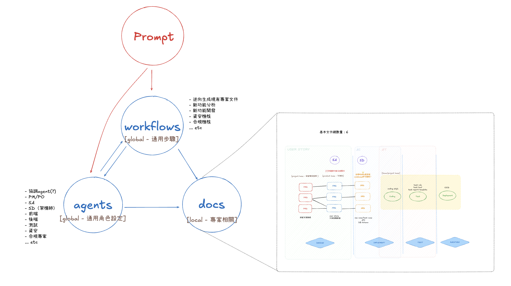
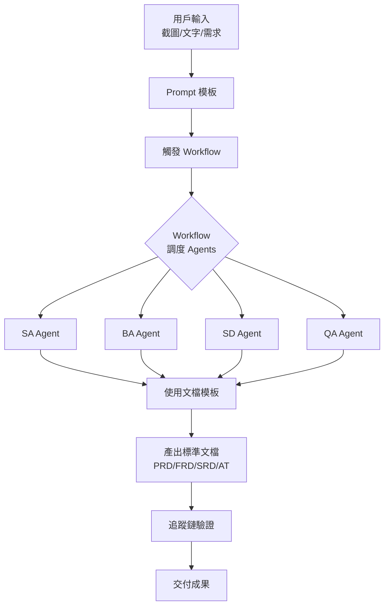

# AI 輔助軟體開發生命週期 (AISDLC) 框架

## ⚠️ **重要：使用前必讀**

**每個 AI 對話 session 都必須從專案整合開始！**
不整合就直接使用 = 浪費 Token + 錯誤結果

→ 請先閱讀 30 秒快速整合指南←

---

## 🛡️ **反幻覺規則（強制遵守）**

**AISDLC 框架的最高優先級原則：寧可空白，不可捏造**

使用本框架時，所有 AI 輸出都必須嚴格遵守反幻覺規則：

### 核心規則
- ✅ **事實檢查**：回答前必須進行事實檢查，禁止假設、推測或自行創造內容
- ✅ **嚴格依據來源**：僅使用明確提供或可驗證的資料
- ✅ **零推測原則**：遇到任何需要假設的情況必須立即停止並詢問人類
- ✅ **顯示依據**：所有推論必須說明來源
- ✅ **誠實聲明不確定**：資訊不足時直接說明「沒有足夠資料」或「我無法確定」
- ✅ **保持語意一致**：不可改寫或擴大使用者原意

### 📋 快速檢查
使用框架前請確認：
- [ ] 是否已載入 `AISDLC_INIT.md`（包含反幻覺規則載入）
- [ ] 是否看到「反幻覺規則已啟用」的確認訊息
- [ ] 是否了解「寧可空白，不可捏造」的核心原則

**詳細說明**：
- 📋 [ANTI_HALLUCINATION_CHECKLIST.md](./ANTI_HALLUCINATION_CHECKLIST.md) - 執行檢查清單
- ⚙️ [anti-hallucination-rules.yaml](./anti-hallucination-rules.yaml) - 全局規則配置

---

## 🚀 30 秒快速整合到任何專案

### Step 1：整合框架到專案（推薦使用 Git Submodule）
```bash
# 推薦方式：使用 git submodule
cd your-project/
git submodule add <AISDLC-repo-url> aisdlc

# 或直接複製（適合快速測試）
```

### Step 2：載入配置
```
請載入 aisdlc/AISDLC_INIT.md 文件，建立按需載入的 workflow-agent 映射關係
```
（若直接複製方式，路徑為 `AISDLC_INIT.md`）

### Step 3：開始使用
```
執行 [workflow名稱] workflow 分析我的需求：
[貼上你的截圖或需求描述]
```


> 💡 **需要更多幫助？**
 [INTEGRATION_GUIDE.md](./INTEGRATION_GUIDE.md)

---

### 📚 相關文檔
- **📖 快速啟動指南**：[prompts/START.md](./prompts/START.md)
- **📋 使用範例集合**：[prompts/EXAMPLES.md](./prompts/EXAMPLES.md)
- **🔗 Workflow Prompts**：[prompts/workflow-prompts/](./prompts/workflow-prompts/)

---

## 📋 AISDLC 框架介紹

本專案旨在定義一個結構化的框架，利用大型語言模型（LLM）與 AI 代理人（Agents）來輔助軟體開發生命週期（SDLC）的各個階段。

## 核心概念

此框架基於三大核心支柱：`Agents`、`Workflows` 和 `Docs`。


*(上圖為此框架的視覺化表示)*

### 1. Agents (代理人) - [通用角色設定]

Agents 是模擬特定開發團隊角色的 AI 人格。每個 Agent 都具備其專業領域的知識和技能，負責執行相關任務。

**主要角色包括：**

*   **協調 Agent (Coordinator):** 負責協調其他 Agents 的工作流程。
*   **PM/PO (產品經理/產品負責人):** 定義產品願景、需求和優先級。
*   **SA (系統分析師):** 分析使用者需求，撰寫使用者故事（User Story）。
*   **BA (業務分析師):** 負責利害關係人管理、需求驗證和人機協作確認。
*   **SD (系統設計師/架構師):** 設計系統架構、API 和資料庫結構，並定義驗收標準（Acceptance Criteria）。
*   **前端/後端開發者 (Frontend/Backend Developer):** 負責程式碼的實現。
*   **測試 (Tester/QA):** 確保軟體品質。
*   **資安/合規專家 (Security/Compliance Expert):** 進行安全性與合規性檢核。

### 2. Workflows (工作流程) - [通用步驟]

Workflows 是一系列可重複使用的標準化流程，可以由 Agents 根據當前任務（Task）的需要來執行。LLM 能夠評估當前情境，並建議適合的 Workflow 給 Agent。

**常見的 Workflow 包括：**

*   逆向生成現有專案文件
*   新功能分析
*   新功能開發
*   需求變更管理
*   API規格生成與更新
*   資安檢核
*   合規檢核

### 3. Docs (文件) - [專案相關]

Docs 是專案的核心產出與上下文。所有開發過程都圍繞著一系列標準化的文件進行，這些文件是 Agents 之間溝通和交接的基礎。

**主要文件流程：**

1.  **PRD (產品需求文件):** 由 PM/PO 產出，描述產品的商業需求與目標。
2.  **FRD (功能需求文件):** 由 SA 根據 PRD 撰寫，細化為具體的使用者故事（User Story）和功能規格。此階段由 BA 進行利害關係人驗證和人機協作確認，僅保留最新版本以反映當前需求。
3.  **SRD (系統需求文件):** 由 SD 根據 FRD 撰寫，包含技術層面的實作細節，如 Use Case、API Schema、資料庫結構等，作為開發和測試的依據。
4.  **API 規格文件:** 系統包含API時**強制產出**，每個API都有獨立的詳細規格文檔，嚴格遵循標準模板，並與需求文檔建立完整追蹤鏈。

這個以文件為中心的方法確保了開發過程的每個環節都有清晰的記錄和依據，從 `DESIGN` -> `IMPLEMENT` -> `TEST` -> `MAINTAIN`。

### 🔄 框架運作機制

AISDLC 框架通過以下流程協同運作：



**核心流程說明：**

1. **用戶觸發**：透過 Prompt 模板提交需求（截圖、文字或混合輸入）
2. **Workflow 啟動**：根據需求類型自動選擇對應的 Workflow
3. **Agent 協作**：Workflow 調度相關 Agents 協同工作
4. **文檔產出**：Agents 使用標準模板生成規範文檔
5. **品質保證**：多層驗證機制確保文檔一致性和準確性

**詳細流程圖請參考：**
- [Agent 協作模式](./agent/README.md#agent-協作模式)
- [Workflow 工作流程](./workflow/README.md)

## 🚀 快速 Workflow 選擇指南

| 你有什麼？ | 你想得到什麼？ | 用哪個 Workflow |
|----------|-------------|----------------|
| 截圖/想法 | 需求分析報告 | [統一需求提取](./prompts/workflow-prompts/1-requirements-extraction.md) |
| 需求報告 | 正式 PRD/FRD | [需求驗證與文檔化](./prompts/workflow-prompts/2-validation-documentation.md) |
| PRD/FRD | 開發規格 | [用戶故事與系統設計](./prompts/workflow-prompts/3-user-story-design.md) |
| 現有需求 | 修改需求 | [需求變更管理](./prompts/workflow-prompts/4-requirements-change.md) |
| SRD 文檔 | API 規格 | [API 規格生成與更新](./prompts/workflow-prompts/5-api-specification.md) |
| 專案文檔 | 檢查報告 | [文檔一致性檢查](./prompts/workflow-prompts/6-consistency-check.md) |
| SRD 缺交互流程 | 前後端設計 | [前後端交互分析](./prompts/workflow-prompts/7-interaction-analysis.md) |
| 要使用 TDD 開發單一功能 | 測試驅動實作 | [TDD 開發流程 🆕](./prompts/workflow-prompts/8-tdd-development.md) |

完整 Workflow 列表及詳細說明請參考：**[Workflow 總覽](./workflow/README.md)**

---

## 🛡️ AI 幻覺防護機制 (2025-09 重大更新)

AISDLC 框架內建全面的 AI 幻覺防護機制，確保開發過程的準確性和可控性：
**品質效益**：AI 錯誤減少 90%、文檔一致性 100%、人類完全控制
詳細說明請參考：[TDD Workflow 文檔](./workflow/tdd-feature-development-workflow.md)

### 📚 相關資源
- **[Workflow 總覽](./workflow/README.md)** - 完整工作流程指南
- **[Workflow Prompts](./prompts/workflow-prompts/)** - 8 個觸發模板
- **[快速開始指南](./prompts/START.md)** - 初次使用指南
- **[使用範例](./prompts/EXAMPLES.md)** - 實際應用範例集合


## 🎯 核心工作流程

### 需求管理
- **[需求變更管理](./workflow/requirements-change-management/requirements-change-management.md)** - 追蹤鏈分析、影響評估、6階段協作
- **[需求追蹤分析](./workflow/requirement-traceability-analysis.md)** - PRD → FRD → SRD → AT 完整性驗證

### 開發協作
- **[前後端交互分析](./workflow/frontend-backend-interaction-analysis.md)** - 序列圖生成、狀態同步、API 時序
- **[TDD 開發](./workflow/tdd-feature-development-workflow.md)** - 零推測、規格合規、測試管理
- **[API 規格管理](./workflow/api-specification-generation.md)** - 一 API 一文檔、雙向追蹤鏈
- **[文件一致性檢查](./workflow/document-consistency-check.md)** - 全方位檢查、優先級分級

**完整列表**：[Workflow 總覽](./workflow/README.md)

## 📖 進階主題

- **[多倉庫協作](./INTEGRATION_GUIDE.md#多倉庫協作)** - Git Submodule 管理指南
- **[Agent 詳細說明](./agent/README.md)** - 所有 Agent 的角色定義和配置
- **[文檔模板](./docs_template/README.md)** - PRD、FRD、SRD 等標準模板

---

## 📈 專案執行紀錄

*   **v2.0 (2026-04-02)**：初始化 GAS 架構，實作訂單、菜單、營收基本功能。
*   **v2.1 (2026-04-10)**：導入 AISDLC 框架，實作內外分離架構與 LINE 整合。
*   **v2.2 (2026-04-23)**：**安全性加固補強**。引入 LockService、Rate Limit、CORS 與自動化日誌系統。
