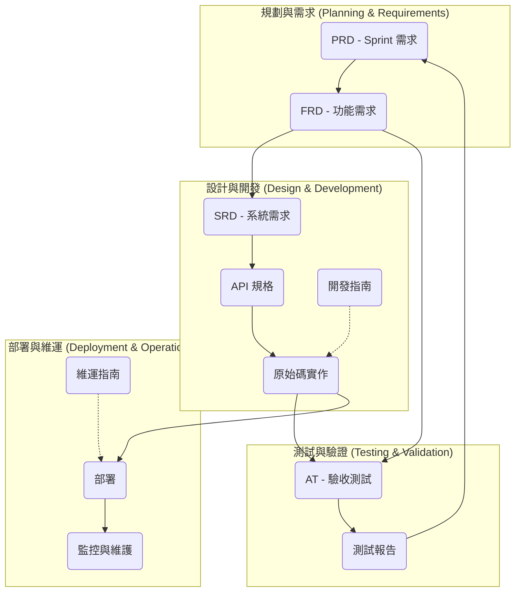

# Docs (文件) - [專案相關]

Docs 是專案的核心產出與上下文。所有開發過程都圍繞著一系列標準化的文件進行，這些文件是 Agents 之間溝通和交接的基礎。

本目錄提供了 AISDLC 框架中推薦的各類標準化文件模板。

## 主要文件流程

根據 [AISDLC 框架](../README.md)，主要的文件流程如下：

1.  **PRD (產品需求文件):** 由 PM/PO 產出，描述產品的商業需求與目標。
2.  **FRD (功能需求文件):** 由 SA 根據 PRD 撰寫，細化為具體的使用者故事（User Story）和功能規格。此階段僅保留最新版本以反映當前需求。
3.  **SRD (系統需求文件):** 由 SD 根據 FRD 撰寫，包含技術層面的實作細節，如 Use Case、API Schema、資料庫結構等，作為開發和測試的依據。

這個以文件為中心的方法確保了開發過程的每個環節都有清晰的記錄和依據，從 `DESIGN` -> `IMPLEMENT` -> `TEST` -> `MAINTAIN`。

---

# 文檔模板使用指南

## 1. 體系概述 (System Overview)

本文件模板旨在建立一套從需求、設計、開發、測試到維運的完整、可追蹤的軟體開發文檔體系。其核心追蹤鏈確保了需求的落地與驗證：

```
User Story → Acceptance Criteria → Acceptance Test
```

此體系不僅涵蓋核心開發流程，也包含開發與維運的標準化指南，以確保團隊協作的一致性與專案品質。

## 2. 文檔類型、用途與產生時機

### 核心交付文檔 (Core Deliverables)

| 文檔類型 | 用途 | 產生時機 | Owner Agent(s) | 關聯 | 模板 |
| :--- | :--- | :--- | :--- | :--- | :--- |
| **PRD** | 定義 Sprint 的目標、範圍與交付成果。 | 每個 Sprint 開始時。 | `PM/PO` | 驅動 FRD 的建立與範疇切分。 | [PRD 模板](./prd/PRD_Sprint_Template.md) |
| **FRD** | 詳細定義功能需求、User Stories 和驗收標準，是領域知識的核心。 | 需求分析階段，隨功能演進持續更新。 | `SA`, `PM/PO` | 承接 PRD，被 SRD 和 AT 參考。 | [FRD 模板](./frd/FRD_Module_Template.md) |
| **SRD** | 定義技術實現規格，包含架構、API、資料模型等。 | 技術設計階段，當 FRD 需求明確後。 | `SD`, `Frontend/Backend Developer` | 根據 FRD 進行設計，指導開發實作。 | [SRD 模板](./srd/SRD_Module_Template.md) |
| **API 規格** | 詳細的 RESTful API 介面規格文檔，**系統有API時必須撰寫**。 | 系統設計階段，當 SRD 包含 API 設計時必須產出。 | `SD`, `Backend Developer` | 提供完整的 API 認證、參數、回應格式規格。 | [API 規格模板](./srd/API_Specification_Template.md) |
| **AT** | 將 FRD 中的驗收標準轉化為可執行的測試案例。 | 測試設計階段，與 FRD/SRD 同步進行。 | `Tester/QA` | 直接對應 FRD 中的 Acceptance Criteria。 | [AT 模板](./tests/AT_Module_Template.md) |
| **Test Report** | 記錄 Sprint 的測試結果、缺陷和風險評估。 | 每個 Sprint 測試週期結束後。 | `Tester/QA` | 總結 AT 的執行狀況，為 PRD 提供決策依據。 | [測試報告模板](./tests/Test_Report_Template.md) |

### 支援指南 (Supporting Guidelines)

| 指南類型 | 用途 | 產生時機 | Owner Agent(s) | 關聯 | 模板 |
| :--- | :--- | :--- | :--- | :--- | :--- |
| **Developer Guideline** | 提供開發團隊的編碼規範、Git 流程、測試和文檔標準。 | 專案啟動時建立，作為團隊共同遵守的準則。 | `SD`, `Frontend/Backend Developer` | 為 SRD 的實作提供品質標準。 | [開發指南](./Developer_Guideline.md) |
| **Operations Guide** | 提供系統部署、監控、備份和故障排除的操作指引。 | 系統上線前準備，並隨維運經驗持續更新。 | `Frontend/Backend Developer`, `SD` | 描述如何部署和維護 SRD 中設計的系統。 | [維運指南](./Operations_Guide.md) |

## 3. 文檔關聯流程



## 4. 目錄結構建議

```
project_docs/
├── prd/                    # Sprint 級別需求
│   └── PRD_Sprint01_2024-01-01.md
├── frd/                    # 功能需求 (Domain Knowledge)
│   └── FRD_UserAuthentication.md
├── srd/                    # 系統設計
│   ├── SRD_UserAuthentication.md
│   └── api/                # API 規格文檔目錄 (有API時必須)
│       ├── API_Index.md    # API 索引和導航
│       ├── API_UserAuth_Login.md
│       ├── API_UserAuth_Logout.md
│       └── API_UserAuth_Register.md
├── tests/                  # 測試相關
│   ├── AT_UserAuthentication.md
│   └── Test_Report_Sprint01.md
├── guidelines/             # 開發與維運指南
│   ├── Developer_Guideline.md
│   └── Operations_Guide.md
└── architecture.md         # 總體架構
```

## 5. 編號與引用規範

### 編號格式
- **User Story**: `US-[三位數字]` (e.g., `US-001`)
- **Acceptance Criteria**: `AC-[US編號]-[序號]` (e.g., `AC-001-1`)
- **Acceptance Test**: `AT-[US編號]-[序號]` (e.g., `AT-001-01`)

### 跨文檔引用
保持單一事實來源，使用 Markdown 內部連結進行引用，不要複製內容。
- **PRD 引用 FRD**: `[US-001]：用戶登入功能 -> [詳細需求](../frd/FRD_UserAuth.md#us-001)`
- **FRD 引用 SRD/API規格/AT**: `技術設計: [SRD規格](../srd/SRD_UserAuth.md#api-design)` / `API規格: [登入API](../srd/api/API_UserAuth_Login.md)` / `測試案例: [登入測試](../tests/AT_UserAuth.md#at-001-01)`
- **AT 引用 FRD**: `對應 User Story: [US-001](../frd/FRD_UserAuth.md#us-001)`
- **API規格引用 SRD/FRD**: `系統設計: [SRD文檔](../SRD_UserAuth.md#api-design)` / `需求來源: [US-001](../../frd/FRD_UserAuth.md#us-001)`

## 6. 最佳實踐

- **單一事實來源**: User Story 和 AC 只在 FRD 中定義，其他文檔透過連結引用。
- **及時更新**: 需求或設計變更時，立即更新對應的 FRD、SRD 和 API 規格。
- **版本控制**: 使用 Git 追蹤所有文檔變更，重要變更在修訂歷史中記錄。
- **文檔評審**: 建立 PRD (PO)、FRD (PO+Tech Lead)、SRD (技術團隊)、API規格 (SD+Backend Dev)、AT (QA 團隊) 的評審流程。
- **API規格強制**: 系統包含API時，必須使用 [API規格生成工作流程](../workflow/api-specification-generation.md) 確保文檔完備。
- **循序漸進**: 專案初期（MVP）可專注於核心文檔 (PRD, FRD, SRD)，但API規格必須同步完成，待專案成熟再逐步完善所有支援文檔。