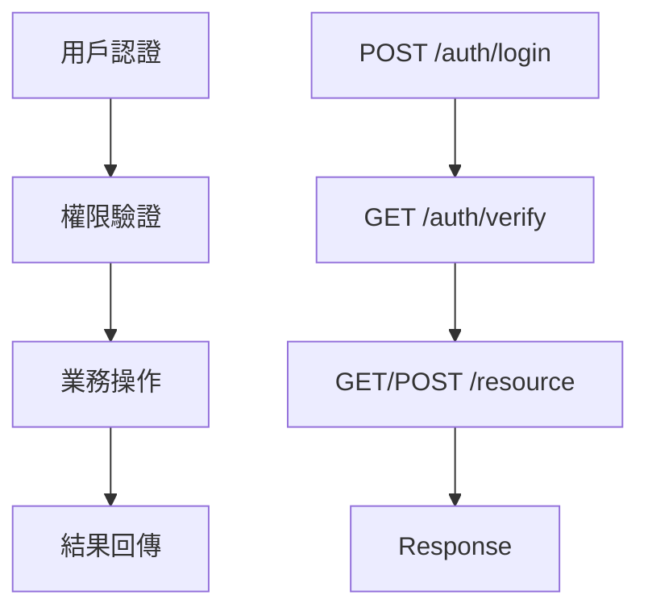

# API 索引 - [系統/模組名稱]

*填寫說明：此文件為 API 規格文件的總索引，提供所有 API 的概覽和導航*
*檔名格式：API_Index.md（放置於 srd/api/ 目錄下）*

---

## 文件資訊

| 項目 | 內容 |
| --- | --- |
| 系統名稱 | [系統名稱] |
| 模組名稱 | [模組名稱] |
| 版本 | v1.0 |
| 最後更新日期 | [日期] |
| 維護者 | [系統架構師/後端開發者] |

## 修訂歷史

| 版本 | 日期 | 作者 | 修改內容 |
| --- | --- | --- | --- |
| v1.0 | [日期] | [系統架構師] | 初版建立 |

---

## API 總覽

### 系統架構概要
*簡要描述此系統/模組的 API 架構和設計原則*

### API 統計資訊
- **API 總數**：[數量] 個
- **認證方式**：[Bearer Token / OAuth2 / API Key 等]
- **基礎路徑**：`https://api.example.com/v1/[module]`
- **支援格式**：JSON
- **文檔版本**：v[版本號]

---

## API 分類導航

### 1. [功能分類1] APIs

| API 名稱 | HTTP 方法 | 路徑 | 描述 | 規格文檔 |
| --- | --- | --- | --- | --- |
| [API名稱1] | GET | /[resource] | [簡要描述] | [API_Module_ResourceGet.md](./API_Module_ResourceGet.md) |
| [API名稱2] | POST | /[resource] | [簡要描述] | [API_Module_ResourcePost.md](./API_Module_ResourcePost.md) |
| [API名稱3] | PUT | /[resource]/{id} | [簡要描述] | [API_Module_ResourcePut.md](./API_Module_ResourcePut.md) |

### 2. [功能分類2] APIs

| API 名稱 | HTTP 方法 | 路徑 | 描述 | 規格文檔 |
| --- | --- | --- | --- | --- |
| [API名稱4] | GET | /[resource2] | [簡要描述] | [API_Module_Resource2Get.md](./API_Module_Resource2Get.md) |
| [API名稱5] | DELETE | /[resource2]/{id} | [簡要描述] | [API_Module_Resource2Delete.md](./API_Module_Resource2Delete.md) |

---

## API 依賴關係圖

### 核心 API 流程


### API 呼叫序列
*描述典型的 API 呼叫順序和依賴關係*

---

## 快速開始指南

### 1. 認證流程
```bash
# 1. 獲取 Access Token
curl -X POST https://api.example.com/v1/auth/login \
  -H "Content-Type: application/json" \
  -d '{"username": "user", "password": "password"}'

# 2. 使用 Token 呼叫 API
curl -X GET https://api.example.com/v1/resource \
  -H "Authorization: Bearer {access_token}"
```

### 2. 常用 API 範例
*提供最常用的 API 呼叫範例*

### 3. 錯誤處理指南
*說明通用的錯誤處理機制和狀態碼*

---

## 環境資訊

### 開發環境
- **基礎 URL**：https://dev-api.example.com/v1
- **文檔 URL**：https://dev-docs.example.com
- **測試工具**：Swagger UI / Postman Collection

### 測試環境
- **基礎 URL**：https://staging-api.example.com/v1
- **文檔 URL**：https://staging-docs.example.com
- **測試資料**：[測試資料說明]

### 生產環境
- **基礎 URL**：https://api.example.com/v1
- **文檔 URL**：https://docs.example.com
- **監控面板**：[監控 URL]

---

## 通用規範

### 請求格式
- **內容類型**：application/json
- **字元編碼**：UTF-8
- **日期格式**：ISO 8601 (YYYY-MM-DDThh:mm:ss.sssZ)

### 回應格式
```json
{
  "code": 200,
  "message": "Success",
  "data": {
    // 實際資料
  },
  "timestamp": "2024-01-01T12:00:00.000Z"
}
```

### 認證標頭
```
Authorization: Bearer {access_token}
Content-Type: application/json
```

---

## 版本控制

### API 版本策略
*說明 API 版本控制策略和向後兼容性原則*

### 版本更新記錄
| API 版本 | 發佈日期 | 主要變更 | 影響範圍 |
| --- | --- | --- | --- |
| v1.0 | [日期] | 初版發佈 | 全新 API |

---

## 相關文檔

### 系統設計文檔
- [SRD - 系統需求文檔](../SRD_[模組名稱].md)
- [系統架構設計](../SRD_[模組名稱].md#系統架構)

### 需求文檔
- [FRD - 功能需求文檔](../../frd/FRD_[模組名稱].md)
- [User Stories](../../frd/FRD_[模組名稱].md#user-stories)

### 測試文檔
- [AT - 驗收測試](../../tests/AT_[模組名稱].md)
- [API 測試案例](../../tests/AT_[模組名稱].md#api-測試)

---

## 開發工具與資源

### 開發工具
- **API 測試**：Postman Collection / Insomnia
- **文檔生成**：Swagger / OpenAPI
- **監控工具**：[監控工具名稱]

### 程式碼範例
- **前端整合**：[前端範例 Repository]
- **SDK/Library**：[相關 SDK 連結]
- **測試工具**：[測試工具設定檔]

### 支援與聯絡
- **技術支援**：[聯絡方式]
- **Bug 回報**：[Issue Tracker]
- **功能請求**：[功能請求平台]

---

## 注意事項

### 使用限制
- **頻率限制**：每分鐘最多 [數量] 次請求
- **資料大小限制**：單次請求最大 [大小] MB
- **同時連線數**：最多 [數量] 個並發連線

### 安全要求
- 所有 API 呼叫必須使用 HTTPS
- 存取 Token 需要定期更新
- 敏感資料需要額外加密

### 最佳實踐
- 建議使用連線池複用連線
- 實作適當的重試機制
- 遵循 RESTful 設計原則

---

*此索引文件應與所有 API 規格文件保持同步更新。當新增、修改或刪除 API 時，請同時更新此索引。*