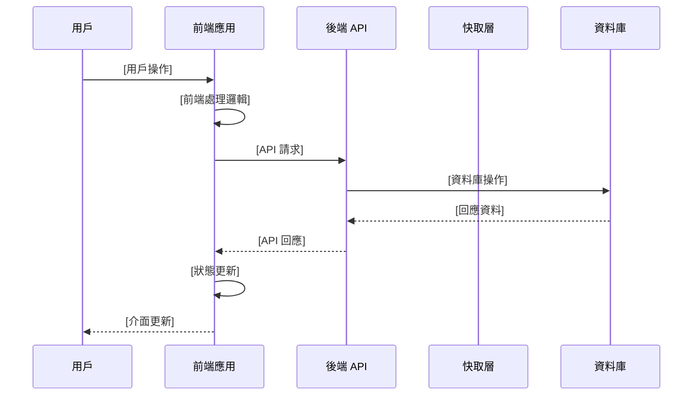

# SRD - [系統/模組名稱]

*填寫說明：定義技術實現規格，對應 FRD 中的功能需求*
*檔名格式：SRD_模組名.md 或 SRD_System_Architecture.md*

---

## 1. 技術架構總覽 (Technical Overview)
*填寫說明：描述此模組的技術架構和設計決策*

### 架構圖
*插入架構圖或使用 Mermaid 語法繪製*

### 技術選型
*說明選擇的技術堆疊和理由*

### 設計模式
*採用的設計模式（如 MVC、Repository Pattern 等）*

### 對應需求
此設計支援以下功能需求：
- [FRD 功能模組](../frd/FRD_模組名.md)

---

## 2. API 設計 (API Specifications)

*填寫說明：定義此模組的 API 端點*

### API: [端點名稱]

- **端點**: `[HTTP Method] /api/v1/[resource]`
- **描述**: *此 API 的功能*
- **對應需求**: [US-XXX](../frd/FRD_模組名.md#us-xxx)

#### Request
```
Headers:
  *必要的 headers*

Parameters:
  *查詢參數或路徑參數*

Body:
  *請求主體結構*
```

#### Response
```
Success (2xx):
  *成功回應格式*

Error (4xx/5xx):
  *錯誤回應格式*
```

#### 範例
*提供 curl 或其他格式的呼叫範例*

---

## 3. 前後端交互流程 (Frontend-Backend Interaction Flow)

*填寫說明：定義完整的前後端協作流程，確保開發團隊理解業務流程中的交互時機*

### 3.1 業務流程序列圖

*填寫說明：使用 Mermaid 繪製主要業務流程的前後端交互序列圖*

#### [主要業務流程名稱]



*根據實際需求調整參與者和交互步驟*

### 3.2 API 調用時序與依賴

*填寫說明：定義 API 的調用順序、依賴關係和前置條件*

#### [功能模組] API 調用流程

**主要流程**：
1. **前置檢查階段**
   - 前端驗證：[驗證項目]
   - 權限檢查：[權限要求]
   - 狀態檢查：[必要的前端狀態]

2. **核心 API 調用**
   - **主要請求**：[主要 API 端點] → [對應需求 US-XXX](../frd/FRD_模組名.md#us-xxx)
   - **依賴 API**：[相關的依賴 API 調用]
   - **並行請求**：[可並行執行的 API 請求]

3. **後續處理階段**
   - **成功路徑**：[成功時的後續動作]
   - **錯誤處理**：[各種錯誤情況的處理]
   - **狀態同步**：[前端狀態更新邏輯]

**調用依賴關係**：
- [API A] → [API B]（[依賴原因]）
- [API C] ⟷ [API D]（[互相依賴說明]）

### 3.3 前端狀態管理與同步

*填寫說明：定義前端狀態管理策略和與後端的同步機制*

#### 狀態結構設計
```typescript
// 前端狀態示例（可用 TypeScript、JavaScript 或偽代碼）
interface ModuleState {
  data: [資料類型],
  loading: boolean,
  error: string | null,
  lastUpdated: timestamp
}
```

#### 狀態同步策略
- **初始載入**：[初始資料載入方式]
- **增量更新**：[資料變更時的更新策略]
- **即時同步**：[需要即時同步的資料項目]
- **離線處理**：[網路中斷時的資料處理]

#### 快取策略
- **前端快取**：[前端資料快取機制]
- **快取失效**：[快取過期和更新條件]
- **快取穿透**：[繞過快取的條件]

### 3.4 異常處理與容錯機制

*填寫說明：定義異常情況下的前後端協作處理流程*

#### 網路異常處理
- **連線超時**：[超時處理策略]
- **網路中斷**：[斷線重連機制]
- **請求失敗**：[失敗重試邏輯]

#### 業務異常處理
- **權限不足**：[權限檢查失敗的處理]
- **資料衝突**：[併發操作衝突的解決]
- **驗證失敗**：[資料驗證錯誤的回饋]

#### 用戶體驗保障
- **載入狀態**：[載入中的介面顯示]
- **錯誤提示**：[使用者友善的錯誤訊息]
- **降級方案**：[部分功能不可用時的替代方案]

### 3.5 效能優化交互

*填寫說明：前後端協作的效能優化策略*

#### 請求優化
- **批次請求**：[多個請求的合併策略]
- **分頁載入**：[大量資料的分批載入]
- **預先載入**：[預期資料的提前載入]

#### 回應優化
- **資料壓縮**：[回應資料的壓縮方式]
- **欄位過濾**：[按需回傳欄位的機制]
- **快取控制**：[HTTP 快取頭的設定策略]

---

## 4. 資料模型 (Data Model)

*填寫說明：定義資料庫結構*

### Table: [資料表名稱]
*對應需求：[US-XXX](../frd/FRD_模組名.md#us-xxx)*

| 欄位名 | 型別 | 限制 | 描述 |
|--------|------|------|------|
| *id* | *UUID* | *PK* | *主鍵* |
| *column_name* | *type* | *constraints* | *說明* |

### 關聯關係
*描述資料表之間的關聯*

### 索引設計
*列出需要建立的索引*

---

## 5. 系統整合 (System Integration)

*填寫說明：描述與其他系統或服務的整合*

### 內部整合
*與其他模組的介面*

### 外部整合
*第三方服務或 API*

### 訊息佇列/事件
*非同步通訊機制*

---

## 6. 安全設計 (Security Design)

*填寫說明：安全相關的技術設計*

### 認證機制
*如何驗證用戶身份*

### 授權控制
*權限管理方式*

### 資料保護
*加密、脫敏等措施*

---

## 7. 效能設計 (Performance Design)

*填寫說明：效能優化相關設計*

### 快取策略
*使用的快取機制*

### 資料庫優化
*查詢優化、分片等*

### 負載平衡
*流量分配策略*

---

## 8. 部署架構 (Deployment Architecture)

*填寫說明：部署相關的技術細節*

### 環境配置
*開發、測試、生產環境差異*

### 容器化
*Docker、Kubernetes 配置*

### 監控與日誌
*監控指標和日誌策略*

---

## 9. 技術債與限制 (Technical Debt & Limitations)

*填寫說明：已知的技術限制或需要改進的地方*

- *限制 1*
- *技術債 1*