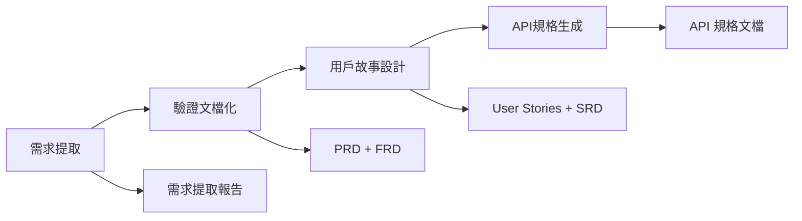

# AISDLC 快速開始指南

**讓 AI 幫你完成專業的需求分析，從想法到開發文檔，2 分鐘開始使用。**

---

## 🚀 30秒開始 - 複製貼上即用

```
我需要分析需求，材料如下：

[在這裡貼上你的截圖描述或文字需求]

請執行完整的 AISDLC 需求分析流程，生成所有開發文檔。
過程中有疑問請詢問我確認。
```

**就是這麼簡單！** 系統會自動執行完整的需求分析，生成 PRD、FRD、SRD、User Stories 和 API 規格。

---

## 💡 2分鐘理解 - AISDLC 能做什麼

### 三種使用方式

#### 方式 1：完整流程（推薦新手）
一次完成從需求提取到 API 規格的全流程
- **適用**：新專案、完整需求分析
- **時間**：2-4 小時（含人機互動）
- **產出**：PRD、FRD、SRD、User Stories、API 規格

#### 方式 2：單一 Workflow（針對性任務）
只執行特定階段的分析
- **適用**：已有部分文檔，需要補充特定內容
- **時間**：30-120 分鐘
- **產出**：依選擇的 workflow 而定

#### 方式 3：文檔檢查（品質保證）
檢查現有文檔的一致性和完整性
- **適用**：已有文檔，需要驗證品質
- **時間**：30-90 分鐘
- **產出**：一致性檢查報告 + 修復建議

---

## 🎯 5分鐘選擇 - 快速決策表

| 你的情況 | 推薦方式 | 使用說明 |
|---------|---------|---------|
| 🆕 **完全新手，有想法或截圖** | 完整流程 | 直接使用上面的"30秒開始" prompt |
| 💡 **新專案，需要完整分析** | 完整流程 | 提供截圖或文字需求，系統引導全流程 |
| 🔄 **修改現有功能需求** | Workflow 4 | [需求變更管理](workflow-prompts/4-requirements-change/) |
| ✅ **檢查文檔品質和一致性** | Workflow 6 | [文件一致性檢查](workflow-prompts/6-consistency-check/) |
| 🔌 **需要生成 API 規格** | Workflow 5 | [API規格生成](workflow-prompts/5-api-specification/) |
| 🎨 **需要前後端交互設計** | Workflow 7 | [前後端交互分析](workflow-prompts/7-interaction-analysis/) |
| 🧪 **測試驅動開發** | Workflow 8 | [TDD開發流程](workflow-prompts/8-tdd-development/) |
| 📸 **只有截圖需要分析** | Workflow 1 | [需求提取](workflow-prompts/1-requirements-extraction/) |
| 📝 **驗證需求完整性** | Workflow 2 | [驗證文檔化](workflow-prompts/2-validation-documentation/) |
| 🚀 **生成 User Stories** | Workflow 3 | [用戶故事設計](workflow-prompts/3-user-story-design/) |

---

## 📖 完整流程說明

當你使用「完整流程」時，系統會按順序執行以下步驟：



### 你會獲得的產出

1. **需求提取報告**
   - 從截圖/文字中識別的功能需求
   - 功能優先級分類
   - 需求追蹤編號

2. **PRD（產品需求文件）**
   - Sprint 目標和範圍
   - 關鍵交付成果
   - 風險和依賴關係

3. **FRD（功能需求文件）**
   - 詳細功能規格
   - User Stories（US-XXX 格式）
   - 驗收標準（AC-XXX-X 格式）

4. **SRD（系統需求文件）**
   - 系統架構設計
   - 資料庫設計
   - API 設計概要

5. **API 規格文檔集**
   - 每個 API 的獨立規格文件
   - API 索引和追蹤關聯
   - OpenAPI/Swagger 格式

---

## 🎨 三種典型使用場景

### 場景 A：我有 UI 截圖

```
我有以下截圖需要分析：

截圖 1：登入頁面，包含帳號密碼欄位和社群登入按鈕
截圖 2：主頁面，顯示產品列表和購物車圖示
截圖 3：產品詳情頁，可以選擇規格和數量

請執行完整需求分析。
```

### 場景 B：我有文字需求

```
我要開發一個線上課程管理系統：
- 教師可以上傳課程、管理學員
- 學員可以購買課程、觀看影片、完成作業
- 管理員可以審核課程、管理用戶

請執行完整需求分析並生成開發文檔。
```

### 場景 C：我需要修改現有功能

```
我需要修改現有的訂單管理功能：

現有功能：用戶可以查看訂單列表
新增需求：加入訂單搜尋和篩選功能（按日期、狀態、金額）

請分析變更影響並更新相關文檔。
```
> 使用 Workflow 4：需求變更管理

---

## 🤝 人機協作提示

AISDLC 強調人機協作，會在關鍵決策點詢問你：

### 常見確認點

1. **輸入理解確認**
   - 系統會總結它理解的需求
   - 你需要確認理解是否正確

2. **功能優先級確認**
   - P0（必須有）：核心功能
   - P1（應該有）：重要功能
   - P2（可以有）：加分功能

3. **技術決策確認**
   - 架構選擇、資料庫設計等
   - 系統會提供建議，由你做最終決定

4. **文檔內容確認**
   - 關鍵文檔產出前會請你確認
   - 確保內容符合實際需求

### 互動技巧

✅ **推薦做法**
- 誠實表達：不確定就說不確定
- 提供背景：說明用戶是誰、目標是什麼
- 積極回應：系統詢問時及時回覆

❌ **避免做法**
- 過於簡短：只回答「是」或「否」
- 跳過確認：想快速完成而忽略確認點
- 技術焦慮：不用擔心描述不夠專業

---

## 📚 進階資源

### 學習更多

- **[完整範例集](EXAMPLES.md)** - 10個精選行業場景範例
- **[Workflow 詳細說明](workflow-prompts/)** - 8個獨立 workflow 的深入介紹

### 單一 Workflow 快速查找

1. **[需求提取](workflow-prompts/1-requirements-extraction.md)** - 從截圖/文字提取需求
2. **[驗證文檔化](workflow-prompts/2-validation-documentation.md)** - 生成 PRD/FRD
3. **[用戶故事設計](workflow-prompts/3-user-story-design.md)** - 生成 User Stories 和 SRD
4. **[需求變更管理](workflow-prompts/4-requirements-change.md)** - 處理需求變更
5. **[API規格生成](workflow-prompts/5-api-specification.md)** - 生成 API 規格文檔
6. **[文件一致性檢查](workflow-prompts/6-consistency-check.md)** - 檢查文檔品質
7. **[前後端交互分析](workflow-prompts/7-interaction-analysis.md)** - 補充交互設計
8. **[TDD開發](workflow-prompts/8-tdd-development.md)** - 測試驅動開發

---

## 💡 立即開始

選擇你的情況：

### 🎯 我是新手
→ 複製「30秒開始」的 prompt，貼上你的需求描述，就能開始！

### 🎯 我要看範例
→ 查看 [EXAMPLES.md](EXAMPLES.md) 中的 10 個精選場景

### 🎯 我要了解特定 workflow
→ 從上面的「快速決策表」找到適合的 workflow 連結

---

**記住**：AISDLC 是來幫助你的，不需要有任何壓力。即使只有一個模糊的想法或一張簡單的截圖，也能幫你生成專業的需求分析文件。
