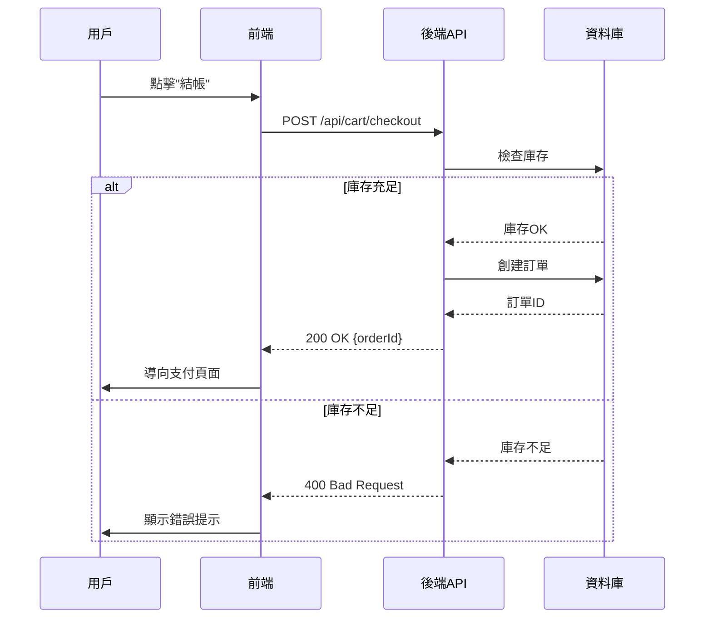

# 7. 前後端交互分析 (Frontend-Backend Interaction Analysis)

## 何時使用

當 SRD 文檔雖已定義 API，但缺乏清晰的前後端協作流程時使用。此 workflow 專注於分析業務流程，設計 API 調用時序、前端狀態管理及異常處理機制，以解決交互時機不明、調用順序模糊等問題。

**適用情境：**
- ✅ 適用於複雜 Web 應用、多步驟業務流程、狀態管理複雜的 SPA
- ✅ 前後端分離架構遇到協作困難時
- ✅ 需要明確 API 調用順序、依賴關係與並行策略
- ❌ 不適用於純後端服務或無前端交互的系統

## 快速模板

```
作為一個專業的系統設計師（SD）與前後端開發團隊，請對我的專案進行前後端交互分析，以補充 SRD 文檔。

- **SRD 文檔**：[SRD 文檔路徑或內容]
- **分析重點**：[需要分析的核心業務流程，例如：購物車結帳流程]
- **技術棧**：[前端：React+Redux，後端：Node.js]
- **問題痛點**：[描述當前問題，例如：前端不確定 API 調用順序]
- **需求**：請為此流程生成 Mermaid 序列圖、API 調用時序與狀態管理策略，並更新至 SRD。
```

## 完整範例

```
作為一個專業的系統設計師（SD）與前後端開發團隊，我需要對電商平台的購物車系統進行前後端交互分析，以解決當前的開發痛點。

**專案路徑**：`/project/ecommerce-platform`

**相關文檔**：
- **SRD**: `/docs/srd/SRD_ShoppingCart.md`
- **FRD**: `/docs/frd/FRD_ShoppingCart.md`
- **API**: `/docs/srd/api/API_Cart_*.md`

**分析重點**：
- **購物車狀態同步**：商品加入、移除、數量修改的即時更新。
- **結帳流程**：從購物車到訂單生成的完整交互序列。
- **庫存檢查**：實時庫存檢查與衝突處理。

**技術棧**：
- **前端**：React + Redux Toolkit
- **後端**：Node.js + Express

**問題痛點**：
- 前端不清楚修改購物車後，何時應重新觸發後端進行價格計算。
- 結帳過程中的 API 調用順序複雜，容易出現競態條件。
- 庫存不足時的錯誤處理與用戶體驗不一致。

**需求**：
請執行前後端交互分析，重點更新 `SRD_ShoppingCart.md`，加入清晰的 Mermaid 序列圖、API 調用時序、前端狀態管理策略（含樂觀更新）及異常處理機制。
```

## 產出說明

此 workflow 旨在強化 SRD，使其成為前後端團隊共同的、清晰的協作藍圖。

### 您將獲得：

-   **增強的 SRD 文檔**: 在原 SRD 中新增「前後端交互流程」章節，包含：

    -   **Mermaid 序列圖**
        -   清晰展示用戶操作、前端、後端、資料庫之間的交互順序
        -   標示同步與非同步調用
        -   突顯關鍵決策點與分支流程

    -   **API 調用時序**
        -   詳細說明 API 的調用順序與依賴關係
        -   標示哪些 API 可以並行調用
        -   定義超時與重試策略

    -   **前端狀態管理策略**
        -   建議的 Redux/Vuex/Pinia 狀態結構
        -   狀態同步機制（樂觀更新 vs 悲觀更新）
        -   本地快取策略
        -   離線處理方案（如適用）

    -   **異常處理機制**
        -   網路異常（timeout, connection failed）
        -   業務異常（庫存不足、權限不足）
        -   系統異常（500 錯誤、服務降級）
        -   用戶體驗設計（錯誤提示、重試按鈕、回退方案）

### 範例：購物車結帳序列圖



### 協作價值

-   **前端開發者**：明確知道何時調用哪個 API、如何處理回應
-   **後端開發者**：理解前端的預期行為，設計更友善的 API
-   **測試人員**：根據序列圖設計整合測試案例
-   **專案經理**：掌握複雜流程的實作細節，更準確地評估風險

---

**返回** [START.md](../START.md) 查看完整使用指南
