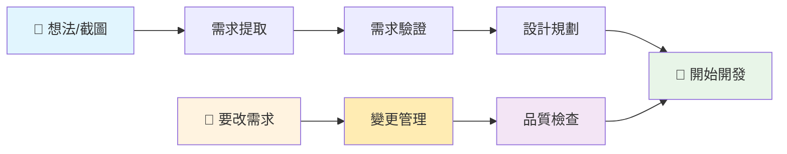
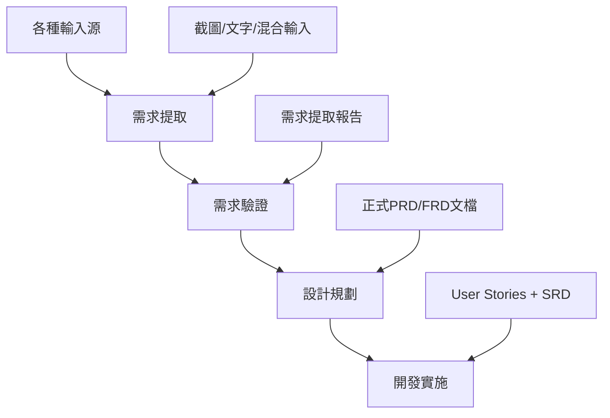
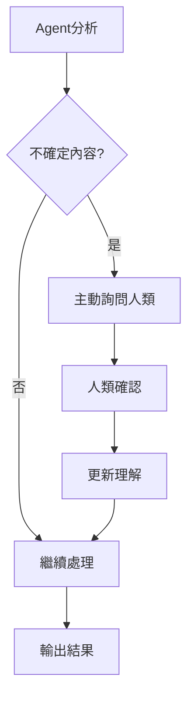

# Workflows (工作流程) - [通用步驟]

## 🎯 一分鐘選擇正確 Workflow

### 最簡單的選擇方式

| 你現在的狀況 | 選用 Workflow |
|------------|-------------|
| 📸 **有截圖/想法，想分析** | [需求提取](unified-requirements-extraction/unified-requirements-extraction.md) |
| 📋 **有需求，要變正式文件** | [需求驗證](requirements-validation-and-documentation.md) |
| 🚀 **有文件，要開發規格** | [設計規劃](user-story-and-design.md) |
| 💻 **口語化需求要開發** | [需求追蹤分析](requirement-traceability-analysis.md) 🆕 |
| ⚡ **要用 TDD 開發功能** | [TDD 開發流程](tdd-feature-development-workflow.md) 🆕 |
| 🔄 **現有功能要改** | [變更管理](requirements-change-management/requirements-change-management.md) |
| ✅ **檢查文件品質** | [品質檢查](document-consistency-check.md) |
| 🔌 **需要 API 規格** | [API 生成](api-specification-generation.md) |
| 🔄 **補充前後端交互** | [交互分析](frontend-backend-interaction-analysis.md) |

### 🚀 三個簡單入口（初學者推薦）

不確定用哪個？用這三個萬能選擇：

1. **🎯 新專案開始**：從零開始 → 依序使用「需求提取」→「需求驗證」→「設計規劃」
2. **🔄 現有專案改動**：要修改 → 使用「變更管理」
3. **✅ 品質確保**：不確定品質 → 使用「品質檢查」

---

Workflows 是一系列可重複使用的標準化流程，可以由 Agents 根據當前任務（Task）的需要來執行。LLM 能夠評估當前情境，並建議適合的 Workflow 給 Agent。

本目錄存放了 AISDLC 框架中定義的各種通用工作流程腳本或指南。

## 快速開始 - 使用 Workflow 模板

### 1. 使用通用模板創建新 Workflow

我們提供了 `workflow-template.md` 通用模板，讓你快速創建新的工作流程：

```bash
# 複製模板
cp workflow-template.md your-new-workflow.md

# 編輯配置
# 根據模板中的註釋指導，填寫所有必要區塊
```

### 2. Workflow 模板結構說明

每個 Workflow 配置包含以下核心部分：

```markdown
## Workflow 基本資訊     # 名稱、描述、適用場景、觸發條件
## 角色與責任           # Primary Owner、Participants、Reviewers
## 輸入與前置條件       # 必要文檔、前置條件、所需資源
## 執行步驟             # 詳細步驟、檢查點、品質標準
## 輸出與交付           # 交付物、交付標準、驗收條件
## 協作與整合           # 與其他 workflows 和 agents 的關聯
## 品質控制與監控       # 品質檢查點、風險控制、成功指標
```

### 3. 創建 Workflow 的步驟

1. **定義基本資訊**：明確 workflow 的目的、適用場景和觸發條件
2. **分配角色責任**：指定主要負責人、參與者和審查者
3. **規劃執行步驟**：設計詳細的執行步驟和檢查點
4. **定義交付標準**：明確輸出物和驗收條件
5. **建立協作關係**：定義與其他 workflows 和 agents 的整合
6. **設置品質控制**：建立檢查點、風險控制和成功指標

### 4. 最佳實踐

- **具體可執行**：每個步驟都要具體且可操作
- **角色明確**：清楚定義每個角色的責任和參與程度
- **品質導向**：建立充分的檢查點和驗收標準
- **協作友好**：考慮與 AISDLC 其他組件的整合

## AISDLC 核心 Workflow 架構

AISDLC 框架採用精簡高效的 Workflow 設計，通過9個核心流程覆蓋從需求輸入、分析驗證、系統設計、交互分析到品質保證的完整過程：

## 🎯 核心 Workflows (已實現)

### 1. 📱 統一需求提取 (unified-requirements-extraction/unified-requirements-extraction.md)
**適用場景**：支援多種輸入形式的需求分析起始流程
- **輸入類型**：純文字、純截圖(PPT/Figma)、截圖+文字、混合輸入
- **核心特色**：智能截圖分析、"不確定就問"原則、強化人機協作
- **關鍵能力**：
  - 單張截圖 → 推斷完整功能模組
  - 多張截圖 → 識別關聯關係(相關流程/獨立需求)
  - 智能缺失資訊識別和主動詢問
  - 4個強制人機確認點確保理解準確性

### 2. ✅ 需求驗證與文檔化 (requirements-validation-and-documentation.md)
**適用場景**：深度驗證需求並生成標準 PRD/FRD 文檔
- **驗證層級**：需求完整性 → 業務邏輯 → 技術可行性 → 優先級排序
- **核心特色**：分層驗證機制、多 Agent 協作驗證、人類決策確認
- **關鍵能力**：
  - 系統性需求完整性檢查
  - 業務流程和價值驗證
  - 技術可行性預評估
  - 生成符合 AISDLC 標準的正式文檔

### 3. 📋 用戶故事與系統設計 (user-story-and-design.md)  
**適用場景**：將驗證需求轉化為可執行的實現方案
- **輸出內容**：Epic分解、User Stories、驗收標準、SRD文檔、開發計劃
- **核心特色**：用戶價值導向、技術實現可行性、完整開發指導
- **關鍵能力**：
  - 需求 → User Stories 的標準化轉換
  - 詳細驗收標準定義(Given-When-Then)
  - 系統架構和API設計
  - 可執行的開發計劃制定

### 4. 🔄 需求變更管理 (requirements-change-management/requirements-change-management.md)
**適用場景**：處理對現有需求的變更請求，確保文檔更新的一致性
- **輸入類型**：文字變更需求、截圖變更、混合輸入變更請求
- **核心特色**：追蹤鏈完整性、6階段人機協作、多維度影響分析
- **關鍵能力**：
  - PRD → FRD → SRD → AT 完整追蹤鏈影響分析
  - 多Agent協作評估（SA、BA、PM/PO、SD、QA）
  - 6個人機協作確認點確保變更理解準確
  - 文檔一致性驗證和矛盾檢測
  - 完整的變更記錄和決策追蹤

### 5. 📋 API 規格生成與更新 (api-specification-generation.md)
**適用場景**：確保每個 API 都有完整且標準化的規格文檔
- **輸入來源**：SRD 文檔、相關 User Story、Acceptance Criteria、Acceptance Test
- **核心特色**：一個API一個獨立文件、嚴格遵循模板、雙向關聯追蹤
- **關鍵能力**：
  - 自動掃描 SRD 識別 API 定義和規格完備性
  - 從 User Story/AC/AT 提取需求資訊生成 API 規格
  - 每個 API 生成獨立規格文件（API_[模組]_[端點].md）
  - 建立 API 文件與 SRD 的雙向關聯和追蹤鏈
  - API 索引管理和文檔品質驗證機制

### 6. ✅ 文檔一致性檢查 (document-consistency-check.md)
**適用場景**：確保所有專案文檔保持高度一致性和完整的追蹤鏈
- **輸入來源**：專案所有文檔（PRD、FRD、SRD、API規格、AT等）
- **核心特色**：全面檢查、系統性驗證、品質量化評估、修復指導
- **關鍵能力**：
  - 需求追蹤鏈完整性驗證（PRD→FRD→SRD→API→AT）
  - 交叉引用和內部連結有效性檢查
  - 內容描述一致性深度分析
  - 格式標準符合度驗證
  - 生成詳細品質報告和修復建議

### 7. 🔄 前後端交互分析 (frontend-backend-interaction-analysis.md)
**適用場景**：補充和增強 SRD 文檔中的前後端協作流程描述
- **輸入來源**：現有 SRD 文檔、FRD 文檔、User Stories、API 規格文檔
- **核心特色**：序列圖生成、狀態同步策略、異常處理設計、SRD 增強
- **關鍵能力**：
  - 從業務流程生成 Mermaid 交互序列圖
  - 設計 API 調用時序和依賴關係
  - 規劃前端狀態管理和同步策略
  - 完善異常處理和容錯機制
  - 更新 SRD 文檔的前後端交互流程章節

### 8. 📋 需求追蹤分析 (requirement-traceability-analysis.md)
**適用場景**：將用戶的口語化需求描述精確對應到專案文檔中的具體功能
- **輸入來源**：用戶需求描述、專案文檔結構（PRD/FRD/SRD/AT）
- **核心特色**：需求對應確認、完整追蹤鏈建立、開發範圍明確定義
- **關鍵能力**：
  - 用戶需求解析和功能搜尋對應
  - PRD→FRD→SRD→AT 完整追蹤鏈建立
  - 多重匹配處理和用戶確認機制
  - 明確開發範圍和交付物定義
  - 建立需求追蹤矩陣和風險識別

### 9. ⚡ TDD 功能開發流程 (tdd-feature-development-workflow.md)
**適用場景**：單一功能的測試驅動開發，確保代碼品質和規格符合
- **輸入來源**：User Story、Acceptance Criteria、PRD/FRD/SRD 文檔
- **核心特色**：完整TDD循環、規格驗證閘門、測試檔案生命週期管理
- **關鍵能力**：
  - 需求追蹤與文檔驗證（強制前置）
  - 紅燈→綠燈→重構完整循環執行
  - 100% Acceptance Criteria 覆蓋率
  - 品質控制與合規檢查
  - AT 測試文檔準備和測試報告生成

## 🤝 支援文檔

### 人機協作協議 (human-collaboration-protocol.md)
- **標準化人機互動格式**：確保所有確認點的一致性
- **主動詢問機制**：定義 Agent 何時必須尋求人類指導
- **協作記錄規範**：完整的決策過程追蹤
- **品質保證機制**：持續優化協作效果

### 需求分析模板 (unified-requirements-extraction/templates/requirement-analysis-template.md)
- **標準化記錄格式**：統一的需求分析結果記錄
- **特殊場景模板**：純截圖、混合輸入等專用模板
- **品質檢查清單**：確保分析過程的完整性
- **追蹤資訊管理**：建立完整的可追蹤鏈條

## Workflow 與 Agent 整合

### Agent-Workflow 對應關係

| Agent 角色 | 主要負責的 Workflows | 參與協作的 Workflows | 關鍵職責 |
|-----------|-------------------|------------------|----------|
| **SA Agent (Amanda)** | unified-requirements-extraction<br/>requirements-validation-and-documentation<br/>user-story-and-design<br/>requirement-traceability-analysis<br/>document-consistency-check | *主導所有核心流程* | 需求理解、文檔撰寫、人機協作協調、需求追蹤矩陣建立、文檔一致性檢查協調 |
| **BA Agent (Beatrice)** | human-collaboration-protocol | unified-requirements-extraction<br/>requirements-validation-and-documentation | 人機協作確認、利害關係人驗證 |
| **PM/PO Agent (Victoria)** | 業務價值判斷 | unified-requirements-extraction<br/>requirements-validation-and-documentation<br/>user-story-and-design<br/>requirement-traceability-analysis | PRD協作、優先級確認、業務價值指導、功能範圍評估 |
| **SD Agent (Marcus)** | user-story-and-design (系統設計部分)<br/>api-specification-generation<br/>frontend-backend-interaction-analysis<br/>document-consistency-check (技術內容) | requirements-validation-and-documentation<br/>user-story-and-design<br/>api-specification-generation<br/>frontend-backend-interaction-analysis<br/>tdd-feature-development-workflow<br/>document-consistency-check | 技術可行性評估、系統架構設計、SRD撰寫、API規格生成與維護、前後端交互流程設計、代碼品質審查、技術文檔一致性檢查 |
| **Dev Agent** | tdd-feature-development-workflow | requirement-traceability-analysis<br/>tdd-feature-development-workflow | TDD 開發循環執行、代碼品質保證、協調開發流程、技術實現 |
| **QA Agent (Quincy)** | 驗收標準定義<br/>document-consistency-check (測試內容) | user-story-and-design<br/>api-specification-generation<br/>tdd-feature-development-workflow<br/>requirement-traceability-analysis<br/>document-consistency-check | 測試場景識別、驗收標準可測試性驗證、API規格可測試性確認、AT測試文檔準備、測試報告生成、測試文檔一致性檢查 |

### 協作流程鏈

#### 🛣️ 從零開始的最佳路徑



#### 核心 Workflow 流程


#### 人機協作流程


#### 完整的端到端流程
```
輸入 → 提取 → 驗證 → 設計 → 開發 → 測試
 ↓     ↓     ↓     ↓     ↓     ↓
截圖   需求   PRD   User  程式碼   AT
文字   報告   FRD   Story      測試
```

## 文檔流程整合

Workflows 完全整合 AISDLC 的文檔驅動開發流程：

### 核心文檔流程
```
PRD → FRD → SRD → API規格 → Implementation → AT → Test Report
 ↓     ↓     ↓      ↓            ↓           ↓       ↓
PM/PO  SA   SD    SD(必須)      Dev         QA      QA
```

**API規格文檔說明**：
- **強制要求**：系統包含API時，必須使用 [API規格模板](../docs_template/srd/API_Specification_Template.md)
- 作為SRD的必要補充文檔，提供完整的RESTful API規格
- **必須包含**：認證機制、請求參數、回應格式、狀態碼等詳細規格
- **目的**：確保前後端開發一致性，提供API測試和集成的標準依據

### 追蹤鏈支援
```
Business Need → User Story → Acceptance Criteria → Acceptance Test → Implementation
```

每個 Workflow 都確保：
- **輸入文檔明確**：清楚定義需要的前置文檔
- **輸出文檔標準**：明確產出的文檔類型和品質要求
- **追蹤鏈完整**：確保需求可以從業務需求追蹤到實作

## 🎯 實際應用場景

### 場景 1：僅有截圖的需求分析 
**輸入**：3張 PPT 截圖（登入頁、列表頁、詳情頁）
```
1. SA Agent 執行 unified-requirements-extraction
   - 智能分析3張截圖的UI元素和流程關係
   - 推斷用戶認證、資料管理等核心需求
   - 通過4個人機確認點驗證理解準確性
   - 輸出：需求提取報告、人機協作記錄

2. SA Agent 執行 requirements-validation-and-documentation  
   - 深度驗證推斷出的需求完整性
   - 評估技術可行性和業務價值
   - 生成標準的 PRD 和 FRD 文檔
   - 輸出：正式需求文檔、驗證報告

3. SA+SD Agent 執行 user-story-and-design
   - 轉換為可執行的 User Stories
   - 設計系統架構和 API 規範
   - 制定開發計劃和資源安排
   - 輸出：User Stories、SRD、開發計劃
```

### 場景 2：混合輸入的新功能開發
**輸入**：Figma 設計稿 + 業務需求文字描述
```
1. unified-requirements-extraction (SA 主導)
   - 分析 Figma 設計稿的互動邏輯
   - 整合文字需求與視覺設計
   - 識別資訊缺失並主動詢問
   - 確認需求映射關係

2. requirements-validation-and-documentation (多Agent協作)
   - SA: 需求完整性驗證
   - BA: 業務流程確認  
   - PM/PO: 業務價值評估
   - SD: 技術可行性分析

3. user-story-and-design (SA+SD 協作)
   - 建立 Epic 和 User Stories
   - 定義 Given-When-Then 驗收標準
   - 設計技術架構和資料模型
   - 規劃 Sprint 和發布計劃
```

### 場景 3：需求變更和迭代優化
**輸入**：現有功能截圖 + 變更需求描述
```
1. unified-requirements-extraction
   - 分析現有功能和變更需求
   - 識別影響範圍和依賴關係
   - 通過人機協作確認變更理解

2. requirements-validation-and-documentation
   - 評估變更對現有系統的影響
   - 驗證變更的業務價值和技術可行性
   - 更新相關的 PRD/FRD 文檔

3. user-story-and-design  
   - 調整相關 User Stories
   - 更新系統設計和 API 規範
   - 制定增量開發計劃
```

## 🔍 特色能力展示

### 智能截圖分析
- **單張截圖深度分析**：從 UI 推斷完整的功能需求和業務邏輯
- **多張截圖關聯識別**：自動判斷是完整流程還是獨立功能
- **缺失流程補充推斷**：基於截圖推測可能的缺失頁面和功能

### 強化人機協作
- **主動詢問機制**：遇到不確定內容立即詢問，避免錯誤推測
- **標準確認格式**：統一的選項呈現和影響分析
- **完整協作記錄**：所有決策過程可追蹤可回溯

### 零遺漏驗證體系
- **多層次驗證**：完整性、業務邏輯、技術可行性、優先級
- **多Agent協作**：各專業角度的充分驗證
- **人類最終確認**：關鍵決策點的人類把關

## 📁 當前目錄結構

```
workflow/
├── README.md                                    # 本文檔，系統說明和使用指南
├── workflow-template.md                         # 通用 workflow 建立模板
│
├── 🎯 核心 Workflows (已實現 - 共9個)
├── requirement-traceability-analysis.md         # 需求追蹤矩陣分析流程
├── requirements-validation-and-documentation.md # 需求驗證與文檔化流程
├── user-story-and-design.md                     # 用戶故事與系統設計流程
├── tdd-feature-development-workflow.md          # TDD 功能開發流程
├── api-specification-generation.md              # API 規格生成與更新流程
├── document-consistency-check.md                # 文檔一致性檢查流程
├── frontend-backend-interaction-analysis.md     # 前後端交互分析流程
│
├── unified-requirements-extraction/             # 統一需求提取模組
│   ├── unified-requirements-extraction.md       # 統一需求提取工作流程
│   └── templates/
│       └── requirement-analysis-template.md     # 需求分析結果記錄模板
│
├── requirements-change-management/              # 需求變更管理模組
│   ├── requirements-change-management.md        # 需求變更管理工作流程
│   └── templates/                               # 變更管理相關模板
│       ├── Change_Request_Template.md
│       ├── Change_Impact_Analysis_Template.md
│       ├── Change_Approval_Record_Template.md
│       └── Change_History_Log_Template.md
│
└── 🤝 支援文檔
    └── human-collaboration-protocol.md          # 人機協作標準協議
```

## 🎯 關鍵特性

### ✅ 已實現功能
- [x] **多輸入支援**：純截圖、純文字、混合輸入全覆蓋
- [x] **智能截圖分析**：UI 元素識別、流程推斷、業務邏輯分析
- [x] **強化人機協作**：22+ 個確認點確保理解準確性
- [x] **"不確定就問"**：主動詢問機制避免錯誤推測
- [x] **分層驗證體系**：完整性、業務邏輯、技術可行性全面驗證
- [x] **標準文檔生成**：符合 AISDLC 標準的 PRD/FRD/SRD/API規格
- [x] **完整追蹤鏈**：從輸入源到最終實現的全程可追蹤
- [x] **API規格自動化**：自動掃描、生成、更新 API 規格文件
- [x] **文檔一致性保證**：系統性檢查、品質評估、修復指導
- [x] **🆕 實作文件一致性驗證**：開發完成後強制回溯驗證實作與文件的一致性
- [x] **🆕 測試檔案智能管理**：標準化檔案命名、生命週期追蹤、自動化清理

### 🔄 工作流程優勢
1. **精簡高效**：9個核心 workflow 覆蓋完整需求到實現和維護流程
2. **零遺漏設計**：多層次驗證確保需求理解準確完整  
3. **人機協作**：關鍵決策點強制人類確認，避免 AI 獨立推測
4. **標準化輸出**：統一的文檔格式和品質標準
5. **靈活輸入**：支援各種輸入形式，特別優化截圖處理
6. **API規格完備**：確保每個API都有標準化的詳細規格
7. **品質保證**：全面的文檔一致性檢查和持續改進機制
8. **🆕 一致性保障**：開發完成後強制驗證實作與文件的完全一致性
9. **🆕 檔案管理自動化**：智能化測試檔案生命週期管理，保持專案整潔

## ⚠️ 重要注意事項

### 人機協作要求
1. **強制確認點**：所有標記為🔴的確認點都必須等待人類確認
2. **不得推測**：Agent 遇到不確定內容時必須詢問，禁止自主推測
3. **完整記錄**：所有人機協作過程都要詳細記錄在 requirement-analysis-template 中
4. **決策透明**：向人類提供充分的分析過程和選項影響分析

### 品質控制標準  
1. **輸入驗證**：所有輸入源都要經過解析驗證和人類確認
2. **需求追蹤**：建立從輸入源到最終實現的完整追蹤鏈
3. **多層驗證**：完整性、業務邏輯、技術可行性的全面驗證
4. **文檔標準**：嚴格遵循 AISDLC PRD/FRD/SRD 模板格式

### 特殊場景處理
1. **純截圖輸入**：使用特殊分析模板，重點推斷缺失資訊
2. **資訊衝突**：詳細記錄衝突內容，通過人機協作解決
3. **複雜流程**：適當拆解為多個確認點，避免資訊過載
4. **變更需求**：維護變更記錄，評估對現有需求的影響

### 成功實施關鍵
1. **Agent 職責清晰**：SA Agent 主導，其他 Agent 專業協作
2. **人類參與充分**：關鍵決策點必須有人類確認參與
3. **流程標準化**：嚴格按照 workflow 步驟執行，不得跳過
4. **持續優化**：基於實際使用效果持續優化協作機制

---

## 🚀 開始使用

### 如何觸發 Workflow

AISDLC 框架的 workflows 需要透過適當的 prompt 來觸發。我們提供了完整的 prompt 指南系統：

#### 📖 Prompt 指南位置
完整的 prompt 使用指南位於：**[`../prompts/`](../prompts/)** 目錄

#### 🎯 觸發 Workflow 的方式

**1. 單一 Workflow 觸發**
- 需求提取：使用 [`1-requirements-extraction.md`](../prompts/workflow-prompts/1-requirements-extraction.md)
- 驗證文檔化：使用 [`2-validation-documentation.md`](../prompts/workflow-prompts/2-validation-documentation.md)
- 用戶故事設計：使用 [`3-user-story-design.md`](../prompts/workflow-prompts/3-user-story-design.md)
- 需求變更管理：使用 [`4-requirements-change.md`](../prompts/workflow-prompts/4-requirements-change.md)
- API規格生成：使用 [`5-api-specification.md`](../prompts/workflow-prompts/5-api-specification.md)
- 文件一致性檢查：使用 [`6-consistency-check.md`](../prompts/workflow-prompts/6-consistency-check.md)
- 前後端交互分析：使用 [`7-interaction-analysis.md`](../prompts/workflow-prompts/7-interaction-analysis.md)
- TDD 開發流程：使用 [`8-tdd-development.md`](../prompts/workflow-prompts/8-tdd-development.md)

**註**: `requirement-traceability-analysis` 是內部分析流程，由 TDD 開發等 workflow 自動觸發，無需手動執行。

**2. 逐步 Workflow 觸發（推薦新手）**

依序使用以下 workflow prompts 完成完整流程：
1. 需求提取：使用 [`1-requirements-extraction.md`](../prompts/workflow-prompts/1-requirements-extraction.md)
2. 需求驗證：使用 [`2-validation-documentation.md`](../prompts/workflow-prompts/2-validation-documentation.md)
3. 設計規劃：使用 [`3-user-story-design.md`](../prompts/workflow-prompts/3-user-story-design.md)
4. API 規格：使用 [`5-api-specification.md`](../prompts/workflow-prompts/5-api-specification.md)

### 快速啟動流程
1. **選擇適當 Prompt**：根據需求到 [`prompts/`](../prompts/) 目錄選擇合適模板
2. **準備輸入材料**：截圖、文字描述或混合輸入
3. **使用 Prompt 觸發**：按照模板填入材料並觸發對應 workflow
4. **配合人機協作**：在確認點提供準確的確認和澄清
5. **驗證最終輸出**：確保生成的文檔符合開發需要

### Prompt-Workflow 對應表

| Workflow | Prompt 位置 | 適用情況 | 輸出文檔 |
|----------|------------|----------|---------|
| unified-requirements-extraction | [`1-requirements-extraction.md`](../prompts/workflow-prompts/1-requirements-extraction.md) | 有截圖或需求需要分析 | 需求提取報告 |
| requirements-validation-and-documentation | [`2-validation-documentation.md`](../prompts/workflow-prompts/2-validation-documentation.md) | 需求已提取，要驗證生成文檔 | PRD/FRD 文檔 |
| user-story-and-design | [`3-user-story-design.md`](../prompts/workflow-prompts/3-user-story-design.md) | 有 PRD/FRD，要生成開發規格 | User Stories + SRD |
| requirements-change-management | [`4-requirements-change.md`](../prompts/workflow-prompts/4-requirements-change.md) | 現有需求需要變更調整 | 變更分析報告 + 更新文檔 |
| api-specification-generation | [`5-api-specification.md`](../prompts/workflow-prompts/5-api-specification.md) | API規格需要生成或更新 | API規格文檔集 + 索引 |
| document-consistency-check | [`6-consistency-check.md`](../prompts/workflow-prompts/6-consistency-check.md) | 檢查專案文檔一致性 | 一致性檢查報告 + 修復建議 |
| frontend-backend-interaction-analysis | [`7-interaction-analysis.md`](../prompts/workflow-prompts/7-interaction-analysis.md) | SRD需要補充交互流程描述 | 更新的SRD文檔 + 交互序列圖 |
| tdd-feature-development | [`8-tdd-development.md`](../prompts/workflow-prompts/8-tdd-development.md) | 測試驅動開發單一功能 | 測試驅動實作 + 規格合規驗證 |
| 逐步完整流程（前5個workflow） | 依序使用 1-5 號 prompt | 要一次完成所有步驟 | 完整文檔集 + API規格 |

### 聯繫和支援
- **Prompt 使用問題**：參考 [`prompts/START.md`](../prompts/START.md) 和 [`prompts/EXAMPLES.md`](../prompts/EXAMPLES.md)
- **Workflow 執行問題**：參考各 workflow 中的品質檢查點和常見問題處理
- **流程優化**：基於 human-collaboration-protocol 提供回饋
- **模板定制**：基於 workflow-template 建立專用流程

**通過這套精簡高效的 Workflow 系統配合完整的 Prompt 指南，AISDLC 框架確保從最少的輸入（如單張截圖）到完整的開發文檔，都能保持高品質和人類監督，為軟體開發提供可靠的需求分析基礎。**


