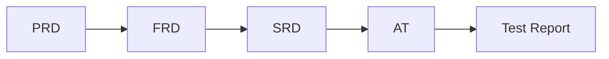

# 變更影響分析文檔模板
# Change Impact Analysis Document Template

> **文檔類型**：Change Impact Analysis  
> **版本**：1.0  
> **建立日期**：[YYYY-MM-DD]  
> **最後更新**：[YYYY-MM-DD]  
> **關聯變更請求**：[CR-YYYY-NNN]

---

## 📋 分析基本資訊 (Analysis Information)

### 分析編號 (Analysis ID)
**CIA-[YYYY]-[NNN]** (例：CIA-2024-001)

### 變更請求概要 (Change Request Summary)
- **變更請求編號**：[CR-YYYY-NNN]
- **變更標題**：[變更請求標題]
- **請求人**：[請求人姓名]
- **變更類型**：[新增功能/修改功能/刪除功能等]

### 分析執行資訊 (Analysis Execution)
- **分析負責人**：[SA/PM/SD 姓名]
- **分析開始日期**：[YYYY-MM-DD]
- **分析完成日期**：[YYYY-MM-DD]
- **參與分析人員**：[列出所有參與分析的人員]

---

## 🔗 追蹤鏈影響分析 (Traceability Chain Analysis)

### 追蹤鏈完整性檢查 (Traceability Chain Integrity)

### 變更起點識別 (Change Origin Point)
**變更起點**：[✅PRD / ✅FRD / ✅SRD / ✅AT]

**起點影響說明**：
[詳細說明變更從哪個文檔層級開始，以及為什麼從這個層級開始]

---

## 📄 文檔層級影響分析 (Document Level Impact Analysis)

### PRD 層級影響 (PRD Level Impact)
**影響評估**：[✅需要更新 / ❌無需更新 / ⚠️可能需要更新]

**具體影響**：
- **Sprint 目標調整**：[是否需要調整當前Sprint的目標和範圍]
- **產品策略影響**：[對整體產品策略的影響]
- **優先級調整**：[是否影響功能優先級排序]
- **交付成果變更**：[對預期交付成果的影響]

**更新範圍**：
- **新增內容**：[需要新增的PRD內容]
- **修改內容**：[需要修改的現有PRD內容]  
- **刪除內容**：[需要刪除的PRD內容]

### FRD 層級影響 (FRD Level Impact)
**影響評估**：[✅需要更新 / ❌無需更新 / ⚠️可能需要更新]

**User Story 影響**：
- **新增 User Story**：
  - [US-XXX]：[新User Story描述]
  - [US-XXX]：[新User Story描述]
  
- **修改 User Story**：
  - [US-XXX]：[修改內容說明]
  - [US-XXX]：[修改內容說明]
  
- **刪除 User Story**：
  - [US-XXX]：[刪除原因說明]

**Acceptance Criteria 影響**：
- **新增 AC**：
  - [AC-XXX-X]：[新AC描述]
  
- **修改 AC**：
  - [AC-XXX-X]：[修改內容說明]
  
- **刪除 AC**：
  - [AC-XXX-X]：[刪除原因說明]

### SRD 層級影響 (SRD Level Impact)
**影響評估**：[✅需要更新 / ❌無需更新 / ⚠️可能需要更新]

**技術架構影響**：
- **系統架構調整**：[對整體系統架構的影響]
- **模組設計變更**：[對特定模組設計的影響]
- **介面設計調整**：[對API或介面設計的影響]

**實作細節影響**：
- **API 變更**：
  - [API端點1]：[變更內容]
  - [API端點2]：[變更內容]
  
- **資料庫變更**：
  - [資料表1]：[結構變更說明]
  - [資料表2]：[結構變更說明]
  
- **業務邏輯調整**：
  - [邏輯模組1]：[調整內容]
  - [邏輯模組2]：[調整內容]

### AT 層級影響 (AT Level Impact)
**影響評估**：[✅需要更新 / ❌無需更新 / ⚠️可能需要更新]

**測試案例影響**：
- **新增測試案例**：
  - [AT-XXX-XX]：[對應AC-XXX-X] - [測試案例描述]
  
- **修改測試案例**：
  - [AT-XXX-XX]：[修改內容說明]
  
- **刪除測試案例**：
  - [AT-XXX-XX]：[刪除原因說明]

**測試策略調整**：
- **測試範圍變更**：[測試範圍的調整]
- **測試方法調整**：[測試方法或工具的變更]
- **測試資料需求**：[測試資料的變更需求]

---

## 🔍 多維度影響評估 (Multi-dimensional Impact Assessment)

### 業務影響分析 (Business Impact Analysis)
**商業價值影響**：
- **正面影響**：[對業務目標的正面貢獻]
- **負面影響**：[可能的業務風險或損失]
- **中性影響**：[不直接影響業務但需要考量的因素]

**用戶體驗影響**：
- **目標用戶群**：[受影響的用戶類型]
- **體驗改善**：[用戶體驗的改善項目]
- **體驗風險**：[可能的用戶體驗風險]
- **學習成本**：[用戶需要的學習成本評估]

### 技術影響分析 (Technical Impact Analysis)
**系統效能影響**：
- **效能提升**：[預期的效能改善]
- **效能風險**：[可能的效能影響]
- **資源使用**：[對系統資源使用的影響]

**技術債務影響**：
- **債務減少**：[有助於減少的技術債務]
- **債務增加**：[可能增加的技術債務]
- **重構需求**：[是否需要相關的重構工作]

**安全性影響**：
- **安全性提升**：[對系統安全性的正面影響]
- **安全性風險**：[可能引入的安全性風險]
- **合規性影響**：[對法規合規的影響]

### 測試影響分析 (Testing Impact Analysis)
**測試工作量評估**：
- **新增測試工作**：[預估的新增測試時間]
- **回歸測試範圍**：[需要執行回歸測試的範圍]
- **自動化測試調整**：[自動化測試腳本的調整需求]

**測試環境影響**：
- **環境配置變更**：[測試環境需要的調整]
- **測試資料需求**：[新的測試資料準備需求]
- **測試工具需求**：[可能需要的新測試工具]

### 資源影響分析 (Resource Impact Analysis)
**時程影響**：
- **開發時程**：[對開發時程的影響評估]
- **測試時程**：[對測試時程的影響評估]  
- **整體專案時程**：[對專案整體進度的影響]

**人力需求**：
- **開發人力**：[需要的開發人員技能和時間]
- **測試人力**：[需要的測試人員技能和時間]
- **其他專業人力**：[UI/UX設計師、DevOps等需求]

**成本影響**：
- **開發成本**：[直接開發成本估算]
- **基礎設施成本**：[可能的基礎設施投資]
- **維護成本**：[長期維護成本變化]

---

## ⚠️ 風險與挑戰 (Risks & Challenges)

### 高風險項目 (High Risk Items)
1. **[風險項目1]**
   - **風險描述**：[詳細風險說明]
   - **影響評估**：[對專案的可能影響]
   - **機率評估**：[高/中/低]
   - **緩解策略**：[風險應對方案]

2. **[風險項目2]**
   - **風險描述**：[詳細風險說明]
   - **影響評估**：[對專案的可能影響]
   - **機率評估**：[高/中/低]
   - **緩解策略**：[風險應對方案]

### 技術挑戰 (Technical Challenges)
- **實作複雜度**：[技術實作的複雜程度評估]
- **技術可行性**：[技術方案的可行性分析]
- **整合挑戰**：[與現有系統整合的挑戰]

### 業務挑戰 (Business Challenges)
- **利害關係人協調**：[需要協調的利害關係人和挑戰]
- **變更管理**：[組織變更管理的挑戰]
- **用戶接受度**：[用戶接受新變更的挑戰]

---

## 🔄 依賴關係分析 (Dependency Analysis)

### 向上依賴 (Upstream Dependencies)
[列出此變更依賴的其他變更或條件]
- **[依賴項目1]**：[依賴說明和狀態]
- **[依賴項目2]**：[依賴說明和狀態]

### 向下影響 (Downstream Impact)
[列出此變更會影響的其他功能或專案]
- **[影響項目1]**：[影響說明和應對策略]
- **[影響項目2]**：[影響說明和應對策略]

### 並行衝突 (Parallel Conflicts)
[列出與其他正在進行的變更可能產生的衝突]
- **[衝突項目1]**：[衝突描述和解決方案]
- **[衝突項目2]**：[衝突描述和解決方案]

---

## 📊 影響總結與建議 (Impact Summary & Recommendations)

### 影響等級評估 (Impact Level Assessment)
- **整體影響等級**：[🔴高/🟡中/🟢低]
- **業務影響等級**：[🔴高/🟡中/🟢低]  
- **技術影響等級**：[🔴高/🟡中/🟢低]
- **測試影響等級**：[🔴高/🟡中/🟢低]

### 可行性評估 (Feasibility Assessment)
- **技術可行性**：[✅可行/⚠️有挑戰/❌不可行]
- **資源可行性**：[✅可行/⚠️有挑戰/❌不可行]
- **時程可行性**：[✅可行/⚠️有挑戰/❌不可行]
- **業務可行性**：[✅可行/⚠️有挑戰/❌不可行]

### 實施建議 (Implementation Recommendations)

#### 建議實施策略 (Recommended Implementation Strategy)
- [ ] **立即實施**：影響範圍可控，風險較低
- [ ] **分階段實施**：建議分為 [N] 個階段執行
- [ ] **延後實施**：建議等待 [條件] 滿足後再執行
- [ ] **不建議實施**：風險過高或效益不足

#### 具體實施建議 (Specific Recommendations)
1. **[建議1]**：[具體建議內容和理由]
2. **[建議2]**：[具體建議內容和理由]
3. **[建議3]**：[具體建議內容和理由]

#### 關鍵成功因素 (Critical Success Factors)
- **[成功因素1]**：[詳細說明]
- **[成功因素2]**：[詳細說明]
- **[成功因素3]**：[詳細說明]

---

## 📝 分析歷史記錄 (Analysis History)

| 版本 | 日期 | 分析師 | 變更內容 | 備註 |
|------|------|--------|----------|------|
| 1.0 | [日期] | [姓名] | 初始分析完成 | [備註] |
| | | | | |

---

## 👥 審核與確認 (Review & Approval)

### 分析審核記錄 (Analysis Review Record)

| 審核角色 | 審核人 | 審核日期 | 審核結果 | 審核意見 |
|---------|-------|---------|----------|----------|
| SA | [姓名] | [日期] | [✅通過/❌退回] | [意見] |
| PM/PO | [姓名] | [日期] | [✅通過/❌退回] | [意見] |
| SD | [姓名] | [日期] | [✅通過/❌退回] | [意見] |
| QA | [姓名] | [日期] | [✅通過/❌退回] | [意見] |

---

**重要提醒**：
1. 本分析報告是變更決策的重要依據，請確保分析的完整性和準確性
2. 高風險變更建議進行更詳細的技術評估和業務影響分析
3. 分階段實施的變更需要制定詳細的階段規劃和里程碑
4. 所有分析結論需要經過相關利害關係人的確認和批准