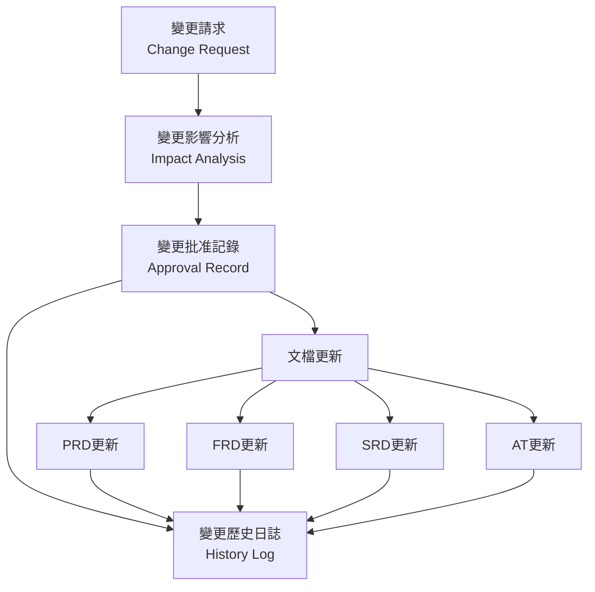

# 變更管理文檔模板 (Change Management Document Templates)

## 📋 概述 (Overview)

此目錄包含 AISDLC 變更管理流程所需的核心文檔模板，支援完整的需求變更生命週期管理。

這些模板專門配合 [requirements-change-management workflow](../requirements-change-management.md) 使用，確保變更過程的可追蹤性和文檔一致性。

## 📁 文檔模板清單 (Template List)

| 模板名稱 | 用途 | 使用時機 | 負責角色 |
|---------|------|----------|----------|
| [Change_Request_Template.md](./Change_Request_Template.md) | 記錄變更請求的詳細資訊 | 變更請求提出時 | 請求人/SA |
| [Change_Impact_Analysis_Template.md](./Change_Impact_Analysis_Template.md) | 分析變更對系統和文檔的影響 | 影響分析階段 | SA/BA/SD |
| [Change_Approval_Record_Template.md](./Change_Approval_Record_Template.md) | 記錄6階段人機協作確認和批准過程 | 審批流程中 | PM/PO/SA |
| [Change_History_Log_Template.md](./Change_History_Log_Template.md) | 維護專案的完整變更歷史 | 持續維護 | SA/PM |

## 🔄 文檔間關聯關係 (Document Relationships)



## 📝 使用指南 (Usage Guide)

### 1. 新變更請求處理流程

#### 步驟 1：建立變更請求文檔
```bash
# 複製模板並重新命名
cp Change_Request_Template.md Change_Request_CR-2024-001.md

# 填寫變更請求詳細資訊
# 重點填寫：變更描述、現狀分析、影響預估、時程要求
```

#### 步驟 2：執行影響分析
```bash
# 複製影響分析模板
cp Change_Impact_Analysis_Template.md Change_Impact_Analysis_CIA-2024-001.md

# 使用 AI 輔助進行多維度影響分析
# 重點：PRD→FRD→SRD→AT 追蹤鏈完整性分析
```

#### 步驟 3：記錄批准過程
```bash
# 複製批准記錄模板
cp Change_Approval_Record_Template.md Change_Approval_Record_CAR-2024-001.md

# 記錄6個人機協作確認點的詳細過程
# 確保每個確認點都有完整記錄
```

#### 步驟 4：更新變更歷史
```bash
# 在變更完成後更新歷史日誌
# 記錄變更的完整生命週期和結果
```

### 2. 文檔命名規範

#### 檔案命名格式
- **變更請求**：`Change_Request_CR-YYYY-NNN.md`
- **影響分析**：`Change_Impact_Analysis_CIA-YYYY-NNN.md`
- **批准記錄**：`Change_Approval_Record_CAR-YYYY-NNN.md`
- **歷史日誌**：`Change_History_Log_[專案名稱].md`

#### 編號規則
- **CR**：Change Request (變更請求)
- **CIA**：Change Impact Analysis (變更影響分析)  
- **CAR**：Change Approval Record (變更批准記錄)
- **YYYY**：年份 (例：2024)
- **NNN**：三位數序號 (例：001, 002)

### 3. 與 Workflow 的整合

#### workflow 觸發
```markdown
請執行需求變更管理分析，變更資料如下：

**變更類型**：[新增功能/修改功能/刪除功能等]
**變更描述**：[詳細描述變更內容]
**現有系統狀況**：[描述目前狀況或提供截圖]

請使用 requirements-change-management workflow 進行分析。
```

#### 6個確認點對應
1. **確認點1：變更理解** → 填寫 Change_Request 模板
2. **確認點2：影響範圍** → 填寫 Change_Impact_Analysis 模板 
3. **確認點3：可行性確認** → 更新 Change_Impact_Analysis
4. **確認點4：更新內容確認** → 記錄在 Change_Approval_Record
5. **確認點5：一致性確認** → 記錄在 Change_Approval_Record  
6. **確認點6：最終批准** → 完成 Change_Approval_Record

## 🎯 最佳實踐 (Best Practices)

### 1. 文檔完整性
- ✅ 每個變更都必須有完整的四套文檔
- ✅ 所有必填欄位都要填寫，不確定的標註「待確認」
- ✅ 相關截圖和附件要確保可存取

### 2. 追蹤鏈管理
- ✅ 嚴格按照 PRD → FRD → SRD → AT 順序分析影響
- ✅ 確保每個層級的變更都有對應的文檔更新
- ✅ 維護編號系統的一致性 (US, AC, AT)

### 3. 人機協作記錄
- ✅ 詳實記錄每個確認點的互動過程
- ✅ 保留 AI 分析結果和人員確認意見
- ✅ 記錄決策理由和考量因素

### 4. 版本控制
- ✅ 使用 Git 追蹤所有變更文檔
- ✅ 重要變更在 commit message 中標註
- ✅ 定期備份重要的變更記錄

## ⚠️ 注意事項 (Important Notes)

### 🚨 必須遵守
1. **不可跳過任何確認點**：6個確認點都必須完整執行
2. **保持文檔同步**：變更完成後立即更新相關文檔
3. **追蹤鏈完整性**：確保 PRD→FRD→SRD→AT 無斷裂
4. **審批流程完整**：重大變更必須經過完整審批

### ⚡ 效率提升
1. **模板預填**：常用資訊可預先填入模板
2. **批量處理**：相關變更可一起進行影響分析
3. **工具輔助**：使用協作工具加速審批流程
4. **經驗復用**：參考歷史類似變更的處理方式

## 📊 品質檢查清單 (Quality Checklist)

### 變更請求文檔檢查
- [ ] 變更描述清楚具體
- [ ] 現狀分析完整準確
- [ ] 影響範圍預估合理
- [ ] 時程要求明確
- [ ] 相關附件齊全

### 影響分析文檔檢查  
- [ ] 追蹤鏈分析完整 (PRD→FRD→SRD→AT)
- [ ] 多維度影響評估詳細
- [ ] 風險識別充分
- [ ] 可行性評估客觀
- [ ] 實施建議具體

### 批准記錄文檔檢查
- [ ] 6個確認點記錄完整
- [ ] 多Agent協作記錄詳實  
- [ ] 決策理由清楚
- [ ] 實施安排明確
- [ ] 監控計畫完整

### 歷史日誌維護檢查
- [ ] 變更記錄及時更新
- [ ] 統計數據準確
- [ ] 趨勢分析有效
- [ ] 經驗教訓有價值

## 🔗 相關資源 (Related Resources)

### 核心 Workflow
- [requirements-change-management.md](../requirements-change-management.md) - 核心變更管理流程

### 觸發指南
- [變更管理觸發指南](../../prompts/workflow-prompts/4-requirements-change/README.md)
- [觸發模板](../../prompts/workflow-prompts/4-requirements-change/templates.md)
- [使用範例](../../prompts/workflow-prompts/4-requirements-change/examples.md)

### 相關文檔模板
- [PRD模板](../prd/) - 產品需求文檔模板
- [FRD模板](../frd/) - 功能需求文檔模板  
- [SRD模板](../srd/) - 系統需求文檔模板
- [AT模板](../tests/) - 驗收測試模板

---

**重要提醒**：變更管理是確保專案品質和可追蹤性的關鍵流程。請嚴格按照模板和流程執行，確保每個變更都有完整的文檔記錄和審批過程。